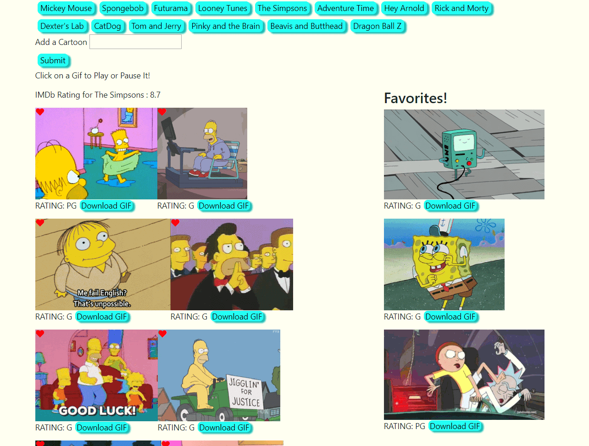

# GifTastic

## Generate random cartoon gifs!

This application allows users to generate 10 new gifs at a time from the GIPHY API by clicking buttons at the top of the page. Users can also create their own buttons to click as well by entering text into the input field. The IMDb rating is also pulled from the OMDB API for each cartoon button pressed. By clicking on a gif itself, users can play and pause the gif. Users are also able to click the heart icon in each gif to move it into the favorites section!

